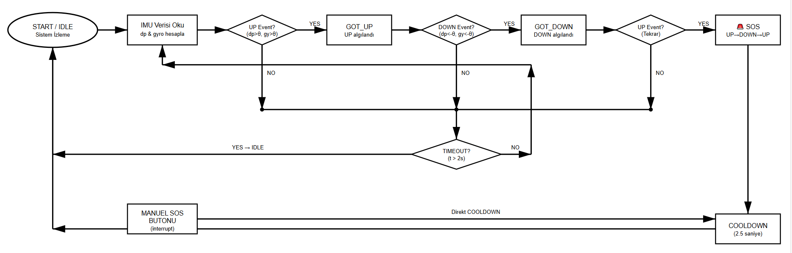

# IMU Silent SOS (FSM Verified)

Embedded demo implementing a silent emergency trigger using an ESP32 + MPU6050 IMU.  
The trigger requires a deterministic UDU gesture sequence verified with a finite state machine (FSM).

## Demo
[Watch demo video](assets/imu-silent-sos-fsm-video.mp4)

## FSM

Sequence:
`IDLE → GOT_UP → GOT_DOWN → SOS_DETECTED → COOLDOWN → IDLE`

Timeout returns to `IDLE` if the sequence is not completed within the time window.

## Gesture logic
Let `dp = pitch - baselinePitch`.

- UP event: `dp > angEnter` AND `gyro > gyGate`
- DOWN event: `dp < -angEnter` AND `gyro < -gyGate`

## Hardware setup
Board: ESP32  
Sensor: MPU6050 (I2C)

Connections:
- ESP32 3V3 → MPU6050 VCC
- ESP32 GND → MPU6050 GND
- ESP32 GPIO21 → MPU6050 SDA
- ESP32 GPIO22 → MPU6050 SCL

Manual SOS button:
- GPIO4 → push button → GND (INPUT_PULLUP)

## Sensor configuration
- Accelerometer range: ±4g
- Gyroscope range: ±500 deg/s
- DLPF bandwidth: 21 Hz

## Code
- `src/imu_silent_sos_fsm_v1_0.ino`

## Notes
Serial commands: `+ - h g p c`
